# Component gallery

Captured from dedicated live examples in Chromium. Each screenshot contains only
the component or editing surface: no example-page title, field label, submit
button, navigation or bound-value output. Component shadow styles are unchanged;
the custom HTML/CSS and Vue/Tailwind examples demonstrate their own styling.

Build with `pnpm build:distribution`, serve `dist/browser` on port 8080, then open
[the component example index](http://localhost:8080/components/). Each gallery
entry below has its own runnable example. See [example source and setup](../examples/components/README.md).

## Standard editor

[Open this example locally](http://localhost:8080/components/standard-editor.html).

The standard editor combines the optional toolbar with the native-form Web Component. The sample includes formatted text, a link and interactive task checkboxes.

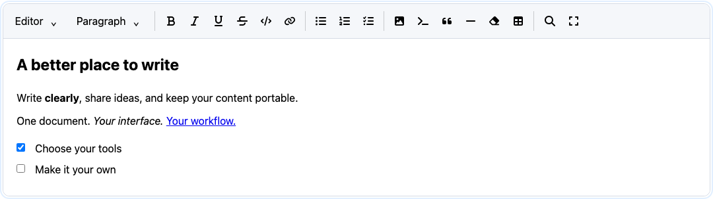

## Base Web Component

[Open this example locally](http://localhost:8080/components/base-editor.html).

The same document without the optional toolbar. Source-view buttons are enabled by the fixture’s `views` attribute.

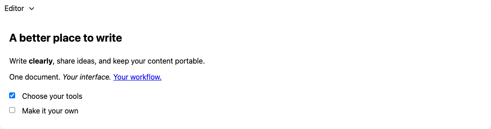

## Formatting toolbar

[Open this example locally](http://localhost:8080/components/toolbar.html).

Font Awesome controls adapt to the selection and enabled tools. Table row/column controls appear only within a table.

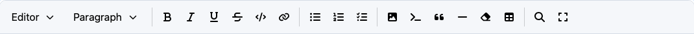

## Table controls

[Open this example locally](http://localhost:8080/components/table-controls.html).

Selecting a table cell exposes row/column operations and Remove table. Removal
leaves a paragraph ready for typing and can be undone.

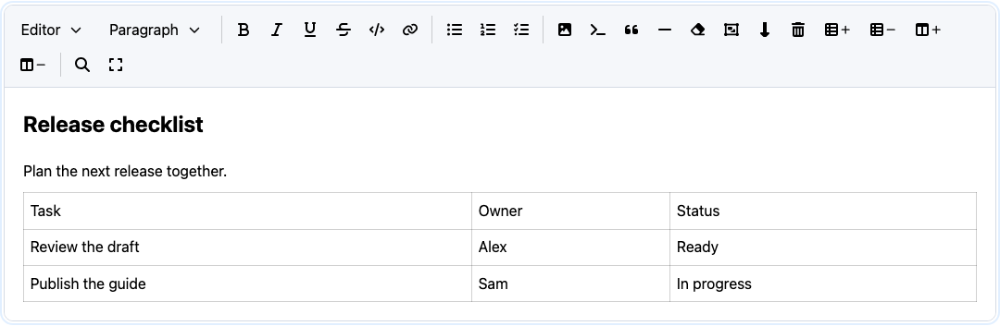

## Horizontal merged cells

[Open this example locally](http://localhost:8080/components/merged-cells.html).

Merge with the cell on the right, split a horizontal span, or insert/remove rows and columns.
Content remains in the left cell when splitting; inserted rows use the full
logical width. Undo restores the previous arrangement.

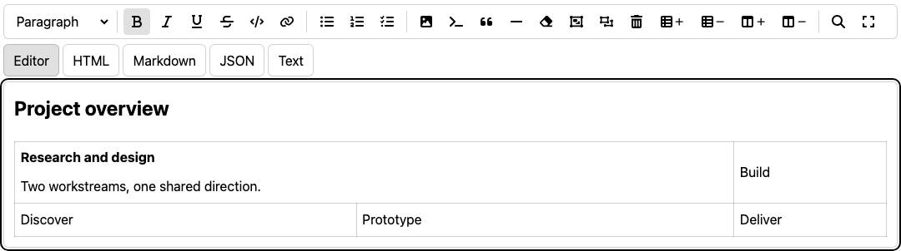

## Link editor

[Open this example locally](http://localhost:8080/components/link-editor.html).

Inline URL entry with Apply, Remove and Cancel controls.

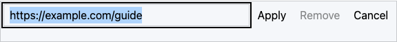

## HTML view

[Open this example locally](http://localhost:8080/components/source-html.html).

Editable HTML source with explicit Apply/Discard.

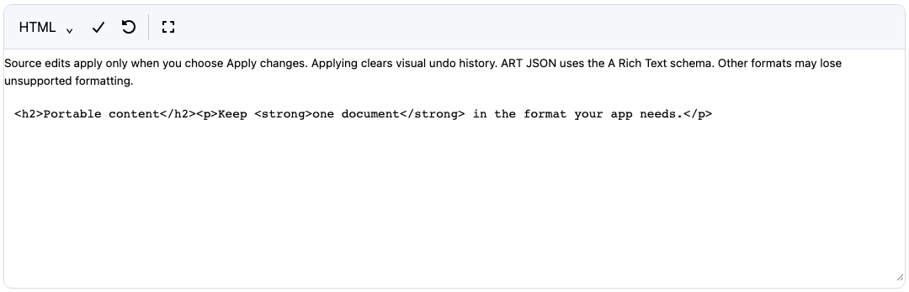

## Markdown view

[Open this example locally](http://localhost:8080/components/source-markdown.html).

Markdown source for the same document.

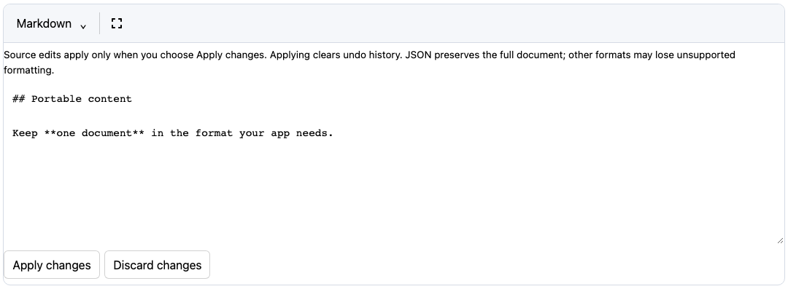

## JSON view

[Open this example locally](http://localhost:8080/components/source-json.html).

Canonical ART JSON source.

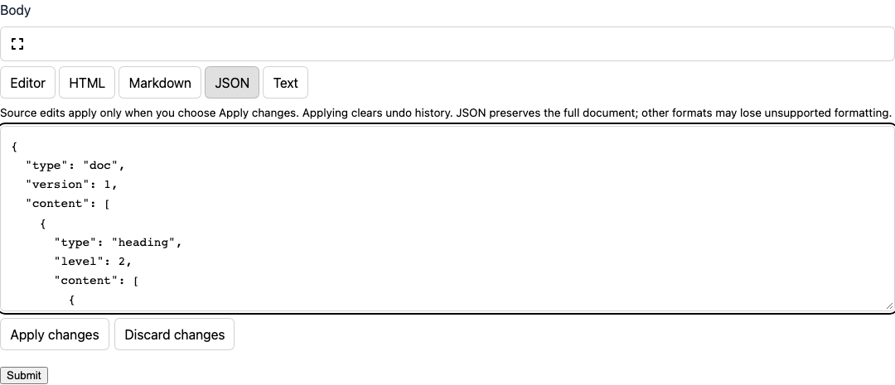

## Plain-text view

[Open this example locally](http://localhost:8080/components/source-text.html).

Plain text omits rich formatting by design.

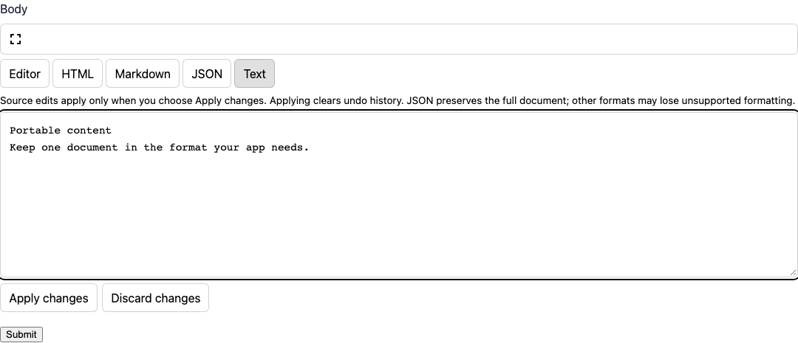

## Find and replace

[Open this example locally](http://localhost:8080/components/find-replace.html).

Search options, result navigation, replacement and highlighted matches.

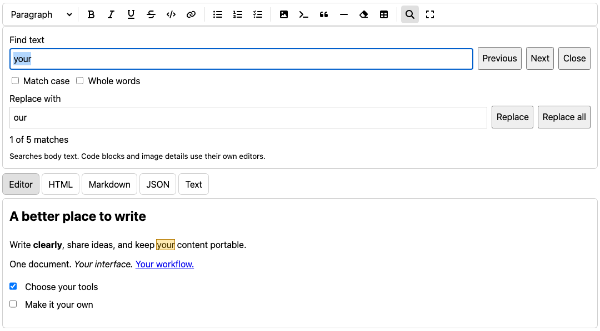

## Code editor

[Open this example locally](http://localhost:8080/components/code-editor.html).

Code text and optional language metadata in a modal editor.

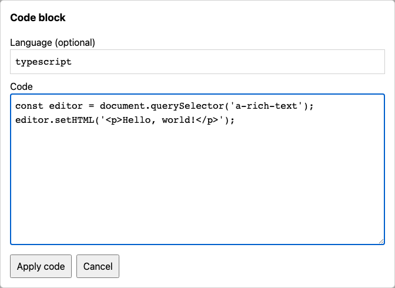

## Image editor

[Open this example locally](http://localhost:8080/components/image-editor.html).

URL, alternative text, dimensions and preview controls. The example URL is illustrative; no image is fetched. Upload controls appear only when a host supplies an uploader.

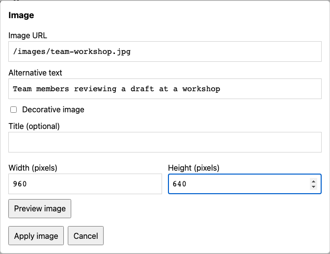

## Focus mode

[Open this example locally](http://localhost:8080/components/focus-mode.html).

The editor and toolbar expand into the built-in focus dialog.

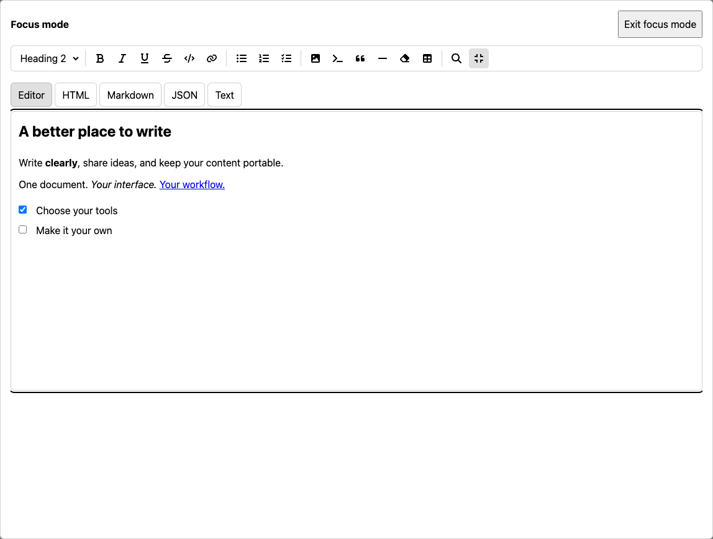

## Mobile layout

[Open this example locally](http://localhost:8080/components/mobile-editor.html).

The same editor at a 390px-wide viewport. This is Chromium viewport resizing, not physical-device certification.

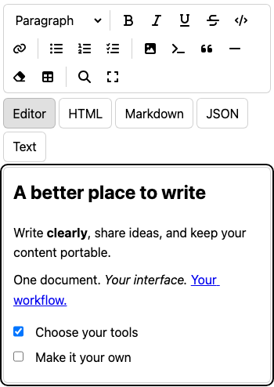

## Custom HTML/CSS toolbar

[Open this example locally](http://localhost:8080/custom-toolbar.html).

The shipped plain-HTML example uses custom buttons, CSS variables and CSS parts.

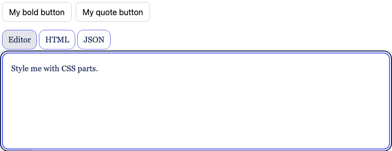

## Vue and Tailwind

[Open this example locally](http://localhost:8080/vue.html).

The shipped optional Vue wrapper uses a toolbar slot, two-way binding and compiled Tailwind styles.

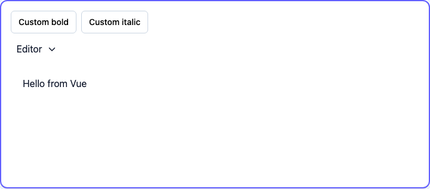

## Packages without built-in visual components

Core, engine, HTML/Markdown conversion, clipboard, persistence, extensions,
links/lists/tables commands, media processing, collaboration, AI, annotations,
comments and suggestions expose data APIs or editor adapters. They do not each
ship a standalone visual widget. Their host-owned interfaces therefore have no
built-in component screenshot; see the corresponding package documentation.

## Refresh the screenshots

```sh
pnpm install --frozen-lockfile
pnpm exec playwright install chromium
pnpm docs:screenshots
```

The command builds the current distribution and examples, starts a temporary
loopback-only server, opens each dedicated example, captures only component bounds and closes the browser/server.
Images live in `docs/screenshots/`; `manifest.json` records browser/version,
viewport and capture names. Review images before committing. Rendering can vary
with OS fonts and browser versions; this is a documentation capture tool, not a
pixel-diff test. No GitHub CI, credentials or external services are needed.

Integration: [configuration](editor-configuration.md) ·
[customization](customization.md) · [image authoring](image-authoring.md).
